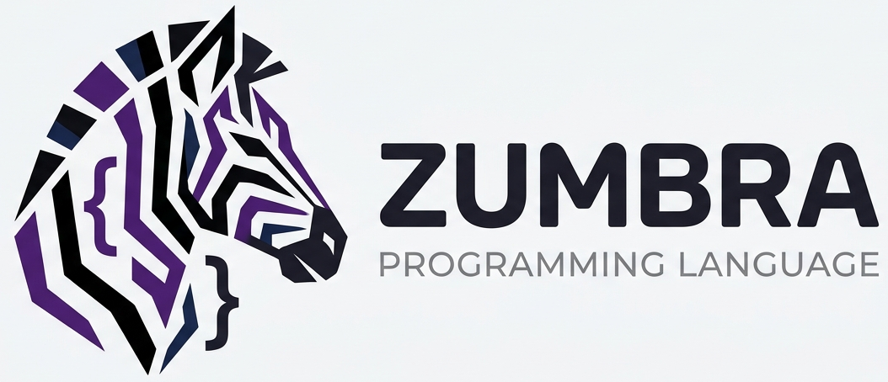

<p align="center">

</p>

> ⚙️ *ZUMBRA is a simple, fun, and expressive programming language made for learning, experimenting, and enjoying the beauty of code.*

<br />
<a href="https://zumbra-web.vercel.app/"><p style="font-size: 30px; font-weight: 600;">🖥️ Official website</p></a>

<p style="font-size: 20px; font-weight: 600; color: red">This readme will no longer be updated, all updates will be on the website</p>

<br />
<p style="font-size: 30px; font-weight: 600;">✨ What is ZUMBRA?</p>

Zumbra is a lightweight, expressive programming language designed and built entirely from scratch. It features a fully custom lexer, parser, compiler, and virtual machine, providing an educational yet powerful platform to explore language design concepts.  

Zumbra supports basic types like integers, floats, booleans, and strings, control flow structures like if and for, and logical operators with proper short-circuit evaluation.

Designed for clarity, simplicity, and extensibility, Zumbra is the perfect playground for learning how modern programming languages work internally.

The rebuild now follows a clear direction: systems, emulation, and game development without abandoning Zumbra's simplicity. See the Portuguese design and feature documentation in [`docs/pt-BR/`](./docs/pt-BR/).

Current systems features include readable bitwise operators, fixed-width integers (`u8` through `u64`, `i8` through `i64`), mutable indexes, compact byte memory, typed integer arrays, zero-copy mutable slices, binary file I/O, endian-aware integer access, buffer copying/comparison, SHA-256 hashing, immutable constants, type aliases, structs with methods, enums, and `match`. Z6 adds a canonical typed pipeline with HIR and MIR. Z7 adds a C11 backend that consumes optimized MIR and produces standalone native executables with Clang or GCC. Z8 adds isolated modules with `pub` exports, module graph inspection, typed C FFI, opaque pointers, synchronous callbacks, native linking, and a conservative C-header binding generator. See [`docs/pt-BR/modulos-abi-e-ffi.md`](./docs/pt-BR/modulos-abi-e-ffi.md).

<br />
<a href="./code_examples/"><p style="font-size: 30px; font-weight: 600;">🛠 Code_examples</p></a>
<br />

<p style="font-size: 30px; font-weight: 600;">📥 How to Run</p>


You can execute `.zum` code using the compiled ZUMBRA binary on different platforms.

<br />
<p style="font-size: 25px">🖥️ Windows</p>

1. Download the `zumbra.exe` file for Windows from the [GitHub Release](https://github.com/JoseLucasapp/Zumbra-lang/releases).
2. Open a command prompt or PowerShell window and run the following command:

   ```bash
   zumbra.exe myscript.zum
   ```

<br />
<p style="font-size: 25px">🐧Linux</p>

1. Download the `zumbra-linux` file for Linux from the [GitHub Release](https://github.com/JoseLucasapp/Zumbra-lang/releases).
2. Make the file executable by running:

   ```bash
   chmod +x zumbra-linux
   ```

3. Run the script with the following command in your terminal:

   ```bash
   ./zumbra-linux myscript.zum
   ```

<br />

<p style="font-size: 25px">🔎 Validation and IR:</p>

```bash
zumbra check app.zum
zumbra modules app.zum
zumbra ir app.zum hir
zumbra ir app.zum optimized
```

<p style="font-size: 25px">🚀 Native build:</p>

```bash
zumbra build app.zum
zumbra build --release app.zum
zumbra build --emit-c app.zum
./build/app
```

Native builds require Clang or GCC. Use `--compiler`, `CC`, and `-o` to control the toolchain and output. Z8 also supports `--link`, `--include`, `--library-dir`, and `-l` for native dependencies.

<p style="font-size: 25px">🧩 Modules and C bindings:</p>

```bash
zumbra modules app.zum
zumbra bind-c --pub --link ../native/library.c -o bindings/library.zum native/library.h
zumbra build --release app.zum
```

<p style="font-size: 25px">⚡ Additional Notes:</p>

- Make sure the ZUMBRA binary file (`zumbra-linux`, `zumbra.exe`) has execution permissions on your system.

- For **Windows**, just run the command without additional configuration.
- For **Linux**, use the `chmod` command to make the file executable.

<br />
<p style="font-size: 30px; font-weight: 600;">📎 VS Code Integration</p>

- We provide a [ZUMBRA VS Code Extension](https://marketplace.visualstudio.com/items/?itemName=joselucasapp.zumbra-lang-support) for syntax highlighting and `.zum` file support.

- > Includes keyword coloring, strings, and built-in function recognition.

<br />
<p style="font-size: 30px; font-weight: 600;">🤝 Contributing</p>
<p style="font-size: 16px;">We welcome contributions! Please read our <a href="./CONTRIBUTING">Contributing Guide</a> and <a href="./CODE_OF_CONDUCT">Code of Conduct</a> before submitting pull requests.</p>

<br />
<p style="font-size: 30px; font-weight: 600;">👨‍💻 Creator</p>
<p style="font-size: 25px">Joselucasapp</p>
<p style="font-size: 17px;">Bringing ZUMBRA to life with love, logic, and a hint of rebellion.</p>
